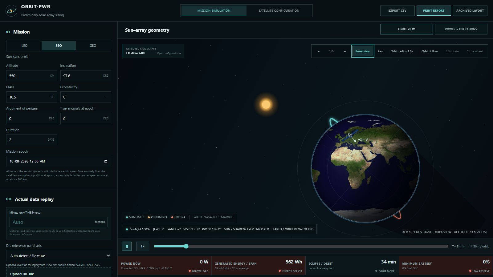
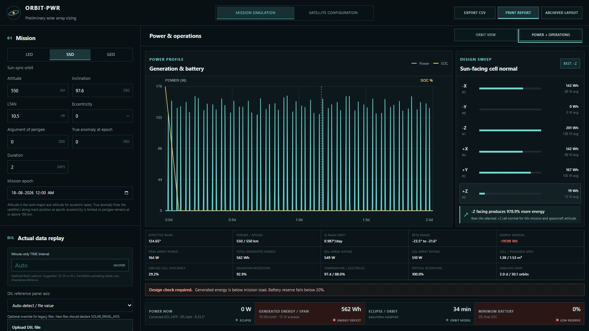
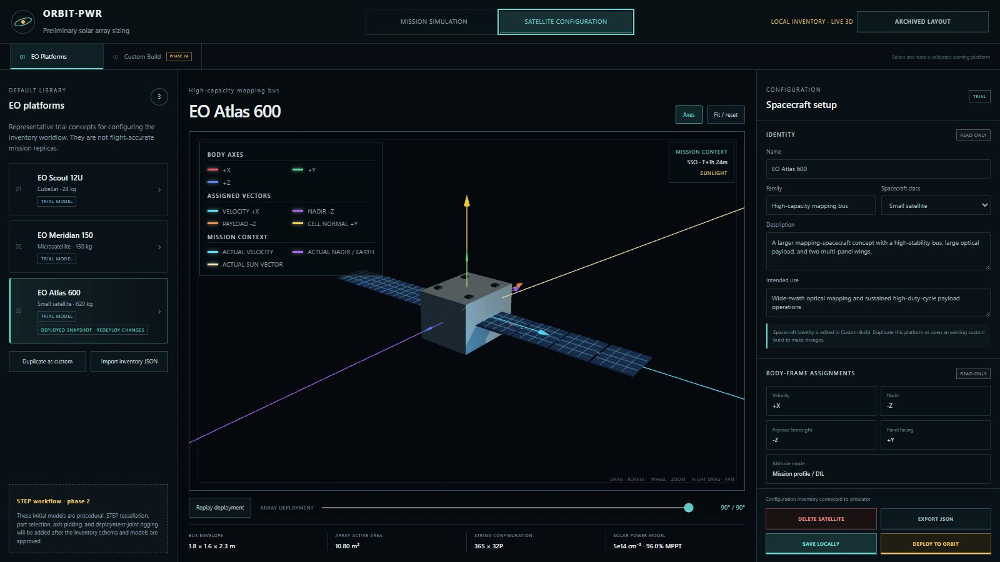

# ORBIT·PWR

Local preliminary satellite solar-array sizing, orbit visualization, spacecraft configuration, and DIL telemetry replay dashboard.

**Current working baseline:** Revision 0 (`0.0.0`)



## What ORBIT·PWR does

ORBIT·PWR keeps the mission model, spacecraft definition, solar-array sizing, and actual-data replay in one local dashboard. It is intended for preliminary engineering and design comparison—not flight qualification.

| Workspace | Purpose |
| --- | --- |
| **Orbit View** | Propagate the mission, inspect lighting and attitude, replay operations, and visualize the complete spacecraft assembly in Earth orbit. |
| **Power + Operations** | Compare generated power, battery state, six signed panel normals, and energy by spacecraft operation. For DIL input, the DIL-derived trace is primary and separate sunlit/eclipse maximum loads produce a conservative OAP/SOC estimate. |
| **Satellite Configuration** | Start from the EO inventory or create a custom spacecraft, assign body axes, attach payload/radio/power parts, configure the array, save locally, and deploy to the simulator. |

## Quick start on Windows

1. Download or clone this repository.
2. Extract it to a normal writable folder if you downloaded a ZIP.
3. Double-click **`Start_Orbit_PWR_Dashboard.bat`**.
4. The dashboard opens at [http://localhost:3000](http://localhost:3000).

The launcher is designed to be the only setup step:

- reuses Node.js 22.13 or newer when it is already installed;
- otherwise downloads a project-private Node.js 24 LTS runtime for Windows x64 or ARM64;
- verifies the official Node.js SHA-256 checksum before use;
- installs or reconciles npm packages automatically, including recovery from a stale lockfile that would otherwise raise `npm EUSAGE`;
- needs no administrator access and does not modify the system Node.js installation;
- reuses an existing ORBIT·PWR instance when port 3000 is already active.

Internet access is needed only for first-time runtime/package downloads. The generated `.orbit-pwr-runtime` and `node_modules` folders can be deleted to reclaim space; the launcher restores them on the next run. Run one launcher window at a time.

## Project sessions

The **Projects** button creates, opens, renames and saves complete local dashboard sessions. Each project is stored under `Orbit_PWR_Projects/<project-name>/` with:

- `project.json` for mission, power, graph and replay settings;
- `spacecraft.json` for independent simulation/deployed spacecraft snapshots;
- `dil/source.csv`, `.tsv` or `.json` for the original DIL source when present; and
- `dil/max-loads.json` for the operation/illumination maximum-load profile.

Opening a project restores the dashboard, spacecraft, DIL replay and maximum loads together. Satellite Configuration can also save an EO platform or custom build directly into any existing project. Project folders are excluded from Git so mission data stays local and can be shared independently when required.

For development with Node.js 22.13 or newer:

```bash
npm install
npm run dev
```

## Mission simulation

### Orbit View

Orbit View combines the propagated orbit, Earth/Sun lighting, eclipse state, spacecraft attitude, operation effects, and live power summary. The deployed-spacecraft card opens the matching Satellite Configuration entry.

Highlights:

- LEO, SSO, and GEO scenarios with altitude, inclination, LTAN, eccentricity, argument of perigee, true anomaly, epoch, and duration controls;
- Kepler propagation, secular J2 RAAN/perigee drift, analytical Sun position, Sun–Earth distance correction, and conical umbra/penumbra;
- NASA Blue Marble Earth texture, Earth-fixed references, illumination-coded orbit path, and one-revolution trail;
- orbit-follow and free 3D views with rotate, pan, zoom, reset, and visual orbit-radius controls;
- 1×, 5×, 10×, 25×, and 50× playback;
- rigid whole-spacecraft attitude motion during DIL replay—the bus and attached parts retain their configured mounts;
- green imaging footprint emitted from the installed optical payload and blue downlink beam emitted from the installed X/Ka-band radio dish;
- shortest-path attitude interpolation between operation states, avoiding unnecessary long rotations;
- a synchronized, unobtrusive DIL-derived/measured power and battery-SOC overlay above the playback controls during actual-data replay.

### Power + Operations



The power workspace presents the generation/battery timeline, signed-axis design sweep, engineering totals, operation-level energy table, and live condition tiles in a responsive layout.

With analytical simulation, the calculated array power is the main trace. With a DIL file loaded, the imported **DIL-derived/measured power becomes the primary trace** and modeled power remains a comparison. The dashboard also reports DIL energy as a percentage of modeled energy, making attitude-constrained generation directly visible.

The chart includes the entered maximum load as a stepped trace. Every legend item is an on/off control, allowing the primary, modeled, perfect-ceiling, maximum-load, and SOC plots to be inspected individually with automatic rescaling. Its cursor reports the current time, DIL/primary generation, maximum load, net power, SOC, illumination/load state, and spacecraft operation. Operation names are preserved in the sortable operation-energy table so imaging, GS pointing, propulsion, transition, and mission-specific states can be compared without being merged.

A dedicated **Calculation toolkit** window opens from below Power balance and exposes the array-power, retention, energy-integration, load, battery, and DIL formulas alongside the active values and model-scope assumptions for calculation cross-checking.

## Satellite Configuration



The configuration workspace separates validated inventory entries from editable custom builds:

- **EO Platforms** contains EO Scout 12U, EO Meridian 150, and EO Atlas 600 as representative, non-flight-qualified starting concepts. Identity and physical configuration are read-only here.
- **Custom Build** is the editing workspace for spacecraft identity, bus geometry, body-frame assignments, installed subsystems, solar-array rigging, cell/string configuration, load, and battery data.
- Inventory entries can be duplicated as custom builds, imported/exported as inventory-schema v1 JSON, saved to browser-local storage, and deployed to Orbit View.
- Any EO platform or custom build can be saved as the independent spacecraft snapshot of a selected project.
- The deployed spacecraft read-only summary reports loss-adjusted BOL and EOL net array power under normal sunlight. It applies the configured temperature, pointing, MPPT, harness, mismatch, diode, contamination, self-shadowing, system-loss, and irradiance corrections; EOL additionally reflects the selected cell's degraded EOL operating point. Raw array ratings remain available in the Power + operations engineering metrics.
- The 3D preview supports unrestricted rotation, zoom, pan, fit/reset, axis display, and array-deployment playback.
- **Save locally** stores the build; **Deploy to orbit** applies the selected build to the mission simulator.

Direct routes after the launcher starts:

- Main dashboard: [http://localhost:3000](http://localhost:3000)
- EO inventory: [http://localhost:3000/satellite-inventory](http://localhost:3000/satellite-inventory)

## Electrical model

The preliminary solar-array model includes:

- AZUR 3G30-Advanced and 4G32-Advanced 4×8/HP catalog values;
- BOL/EOL MPP rating, series/parallel string topology, active area, and packaging efficiency;
- temperature correction, pointing uncertainty, angular response, and Sun-distance correction;
- MPPT/harness, optical, mismatch, diode, contamination, and self-shadowing losses;
- constant-load default playback plus operation-specific DIL max-load energy, battery, and worst-case OAP analysis;
- six-axis (`±X`, `±Y`, `±Z`) energy sweep over the complete attitude and illumination history;
- CSV export and a printable engineering report.

## DIL actual-data replay

Open **Actual data replay → Upload DIL file**. CSV, TSV, and JSON are parsed locally in the browser. Saving a project copies the original source into that local project folder; it is never uploaded to a remote service.

A valid input contains these core fields. The final two universal panel-reference fields are recommended; legacy signed-axis columns and automatic inference remain supported.

```text
TIME
SATELLITE_POSITION
SOLAR_POWER_GENERATED
SPACECRAFT_OPERATION
LATITUDE
LONGITUDE
SUN_BODY
EARTH_BODY
SUNLIT_STATUS
ATTITUDE_RPY
payload_earth
payload_sun
SOLAR_PANEL_AXIS
SUN_PANEL_INCIDENCE
```

Use **Download template** in the dashboard for a ready-to-fill file.

### Input conventions

- `TIME`: elapsed seconds, ISO-8601, or `DD-MM-YYYY HH:mm[:ss]` on a 24-hour clock. AM/PM remains supported. For minute-only timestamps, provide the known row interval or leave it blank for sub-minute inference.
- `SATELLITE_POSITION`: Earth-centred XYZ in kilometres or metres; metre-scale vectors are detected and converted automatically.
- `SUN_BODY`, `EARTH_BODY`: body-frame XYZ vectors.
- `ATTITUDE_RPY`: degrees, interpreted as ZYX roll-pitch-yaw body-to-ECI.
- `SOLAR_PANEL_AXIS`: `+X`, `-X`, `+Y`, `-Y`, `+Z`, or `-Z` for the imported power reference normal.
- `SUN_PANEL_INCIDENCE`: Sun-incidence angle in degrees for that normal.
- `SOLAR_POWER_GENERATED`: measured watts or a detected 0–100 cosine-like generation factor. A detected factor is converted to equivalent watts using the corrected unshadowed EOL array rating.
- CSV vector cells must be quoted, for example `"[6928.137,0,0]"`.

Legacy columns such as `sun_+Y_panels`, `sun_-X_panels`, and `sun_+Z_panels` remain supported. If the axis is absent and `SOLAR_POWER_GENERATED` is a 0–100 factor, Auto mode compares all six body normals against `SUN_BODY` and selects the best-correlated axis. A manual signed-axis override is available for ambiguous files.

The importer compares explicit reference incidence with incidence reconstructed from `SUN_BODY`. It reports mean error and the share of samples that differ by more than 5%. The declared axis can still be replayed when they disagree, but cross-axis comparisons are marked physically inconsistent until the source geometry is corrected.

### Three distinct power results

| Result | Meaning |
| --- | --- |
| **DIL-derived / measured — primary** | The imported reference associated with the declared, detected, or overridden panel axis. A detected 0–100 factor is scaled to the corrected EOL array rating; otherwise the imported value remains measured watts. |
| **Modeled — comparison** | The selected mounted body normal intersected with each row's `SUN_BODY`, gated by illumination and corrected with the configured electrical/loss model. |
| **Perfect-pointing ceiling** | The same EOL and loss model with attitude-incidence loss removed while retaining recorded eclipse and penumbra history. |

Energy is trapezoid-integrated from every original row using its real timestamp interval before display decimation. This preserves totals for regular, irregular, and 10/20/50-second data. Default playback uses a constant 200 W orbit-average load and 1 kWh battery. DIL playback ignores that default load: every imported operation is split into sunlit and eclipse maximum-load states (22 rows for 11 operations). Penumbra uses the eclipse load conservatively while retaining partial generation. Only states encountered by the DIL require a load value. The resulting profile drives load energy, worst-case OAP, net DIL energy, battery SOC, and the chart's stepped maximum-load trace. Inputs remain in memory only and reset with a new DIL or page reload. The six-axis sweep re-evaluates the complete imported attitude/illumination history for every signed normal while keeping the DIL reference fixed.

### Operation visualization

- Operation names beginning with `GSPOINTING` activate a blue animated Earth-directed beam from the installed communication dish.
- Imaging/capture operation names activate a green footprint from the installed optical payload.
- `PAYLOAD_EARTH` and `PAYLOAD_SUN` angles drive target direction.
- Operation effects crossfade over 520 ms; attitude changes use the shortest angular path.

Large files are reduced to at most 60,000 graphical replay samples. This does not alter energy totals: operation and illumination transitions are prioritized, while chart/orbit paths use additional display-only decimation.

## Verification

```bash
npm run lint
npm test
```

`npm test` builds the app and exercises rendered routes, the launcher, orbital references, eclipse discrimination, power/battery bounds, DIL parsing and attitude geometry, timestamp-aware energy integration, operation attribution, measured-power preservation, CSV export, spacecraft inventory behavior, rigid assemblies, and operation-beam source placement.

## Scope

ORBIT·PWR is a preliminary design and replay tool. It is not a flight-dynamics, thermal, radiation, structural, or power-electronics qualification environment. Validate mission-critical results with the appropriate high-fidelity analysis and test chain.
